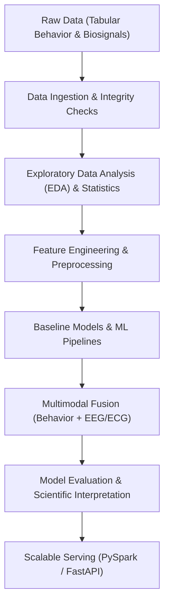

# Chapter 00 — Project Overview

## 1. Why are we learning this?
In a Data Science interview at Citi (or any top financial institution), senior technical interviewers look beyond syntax. They want to see if you can take an ambiguous, real-world research or business problem, break it down into clean data science abstractions, formulate testable hypotheses, design a scalable pipeline, and communicate the findings without overclaiming.

This project overview establishes the architectural blueprint of our end-to-end investigation: **"Music, Brain & Wellbeing: A Data-Driven Study of Human Responses to Music."**

## 2. First-Principles Intuition
Imagine a listener sitting in a quiet room listening to a piece of music.
* **Audio Features** (tempo, key, spectral energy) describe *what the song is*.
* **Behavioral Data** (listening frequency, time of day, skip rates, self-reported mood/wellbeing scores) describe *how the listener interacts with music in daily life*.
* **Biosignals** (EEG brain waves, ECG heart rate variability, GSR skin conductance) measure *how the listener's central and autonomic nervous systems physically respond in real time*.

Our goal is to trace the flow of information from **Music Listening Behavior** to **Human Wellbeing**, and extend it into **Neuroscience (Biosignals)** to understand prediction, association, and physiological response from first principles.

## 3. Core Concept
A structured, reproducible data science project pipeline converts raw, heterogeneous human data (tabular survey/listening metrics and time-series biosignals) into validated statistical insights, machine learning predictions, and scalable infrastructure without data leakage or scientific overreach.

## 4. How It Works Internally
The project is organized into an end-to-end engineering and scientific pipeline:



1. **Ingestion & Validation**: Reading tabular behavioral logs and biosignal waveforms safely.
2. **Exploratory Data Analysis (EDA) & Statistics**: Testing statistical associations (e.g., Pearson/Spearman correlation, hypothesis testing) between music habits and wellbeing indices.
3. **Preprocessing & Feature Engineering**: Handling missingness, outlier detection, scaling, and signal domain extraction (power spectral density for EEG, HRV for ECG).
4. **Predictive Modeling**: Training baseline models (Logistic Regression, Decision Trees) and evaluating generalization performance (cross-validation, ROC-AUC, F1-score).
5. **Multimodal Extension**: Fusing tabular behavioral metrics with physiological biosignals.
6. **Production & Scalability**: Porting high-volume processing steps to PySpark and serving model inferences via FastAPI.

## 5. Tiny Example
Consider predicting whether a listener reports a high wellbeing score ($Y \in \{0, 1\}$) based on their daily music listening duration ($X_1$ in hours) and EEG alpha wave power ($X_2$ in $\mu V^2/Hz$).

In Python, a conceptual pipeline is:
$$\hat{Y} = f(X_1, X_2)$$
Where $f$ is a model trained strictly on past observations without looking at future test data.

## 6. Python Implementation
At this stage of the project, our codebase structure is initialized as follows:

```text
music-brain-wellbeing/
├── data/
│   ├── raw/
│   └── processed/
├── docs/
│   ├── 00_project_overview.md
│   └── 01_problem_and_motivation.md
├── notebooks/
├── src/
│   ├── features/
│   ├── models/
│   ├── evaluation/
│   └── utils/
├── tests/
├── .gitignore
├── README.md
└── requirements.txt
```

## 7. Connection to Our Project
This overview defines the exact boundary of what we are building in `music-brain-wellbeing`. It links our previous audio-only classification work to an expanded, human-centered study connecting listening behavior, psychological wellbeing, and physiological biosignals.

## 8. Why Did We Choose This Approach?
We chose a modular, documentation-first pipeline approach because:
1. **Interview Rigor**: Financial data science interviewers test your ability to explain system modularity, data leakage prevention, and trade-offs.
2. **Reproducibility**: Decoupling raw data, feature processing, modeling, and evaluation ensures every experiment is repeatable.

## 9. Alternatives
* **Monolithic Jupyter Notebook**: Putting all code in a single `.ipynb` file. (Easy for quick hacks, terrible for production, testing, version control, and debugging).
* **Automated Black-Box ML (AutoML)**: Feeding raw data into a black-box auto-trainer. (Provides zero first-principles understanding, prone to data leakage, impossible to defend in a Citi technical interview).

## 10. Tradeoffs
* **Advantage**: High clarity, complete auditability, zero black-box assumptions, interview-defendable code.
* **Disadvantage**: Requires up-front effort in documentation, testing, and pipeline setup before running complex ML models.

## 11. Common Mistakes
* **Mistake**: Jumping straight to complex neural networks or XGBoost before understanding data distribution and missingness.
* **Why it happens**: Eagerness to see model accuracy numbers.
* **Correction**: Establish data integrity, descriptive statistics, and baseline models first.

## 12. Debugging Notes
* No runtime execution errors recorded yet (Pipeline setup phase).

## 13. Interview Questions

### Basic
* **Q**: What is the difference between an exploratory data analysis (EDA) notebook and a production Python module?
* **A**: Notebooks are interactive environments for rapid visualization and state experimentation. Production modules (`.py`) are modular, version-controlled, testable code units built for automated execution pipelines.

### Citi-Style Practical
* **Q**: In a enterprise financial setting, why is documentation and model governance required before deploying an ML model?
* **A**: Models in production impact risk, regulatory compliance, and business decisions. Complete documentation of data lineage, feature definitions, statistical assumptions, and limitations is required for model risk management (MRM) auditability.

## 14. One-Minute Explanation
"This project is a data-driven investigation into human responses to music, linking music listening behavior and physiological biosignals (EEG/ECG/GSR) to psychological wellbeing. We build an end-to-end data science pipeline—from statistical hypothesis testing and feature engineering to predictive machine learning and PySpark scalability—designed from first principles with full scientific auditability and zero data leakage."

## 15. Key Takeaways
1. Data science projects require clear problem formulation before writing code.
2. Production pipelines separate raw data, processing, modeling, and evaluation into modular Python packages.
3. Every technical choice must have a clear rationale, alternative comparison, and tradeoff analysis.
4. Multimodal studies must carefully maintain subject identity integrity across data sources.
5. Interview readiness comes from understanding internal mechanics, not running black-box libraries.

## 16. Status
COMPLETED
